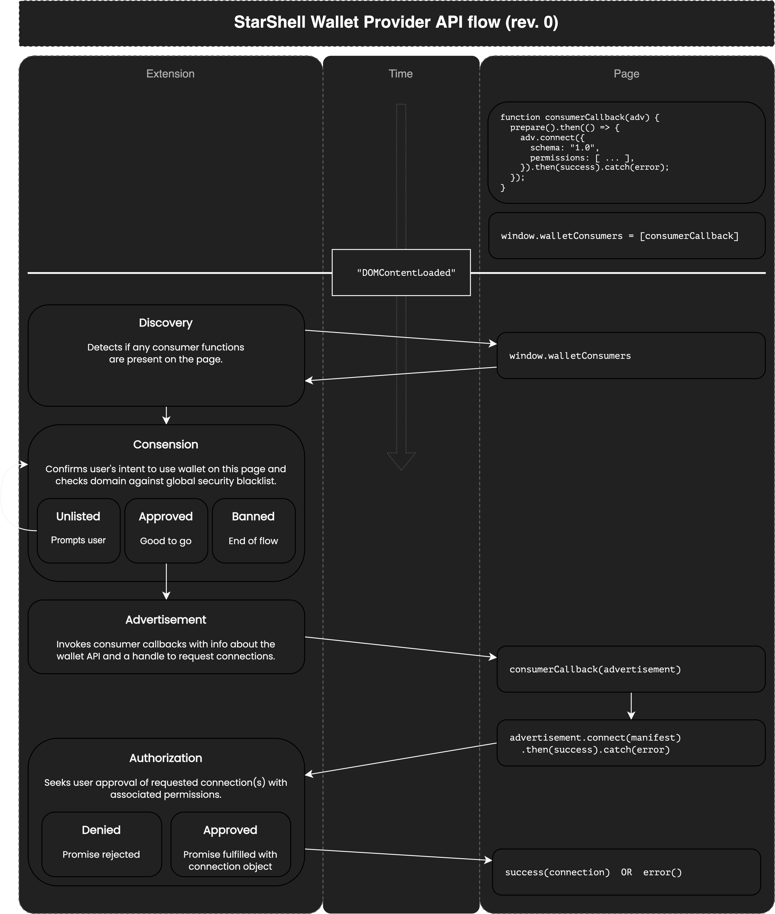

# StarShell Wallet API Primer v0.2

This article is intended for Web3 front-end dApp developers.

## _TLDR;_
The StarShell extension will:
 - **Not** inject any variables into the global window scope by default (i.e., 🚫`window.starshell`).
 - **Require** the use of feature detection rather than API versioning (e.g., `if(walletSupports.someFeature())`).


### `window.someChainOrExtension`: A Regrettable Mistake

The current practice of exposing wallet APIs by injecting a variable into the global scope was a poor idea for two primary reasons:
 1. It degrades user privacy. Any website can see these variables, deduce which extensions are installed, and use that to enhance browser fingerprinting or targeted advertising.
 2. It assumes the user only has one wallet extension they'd like to use with some chain, and extensions may end up competing over the same variable, e.g., `window.ethereum`, `window.solana`, or in our case of providing compatibility with Keplr, `window.keplr`.

Given these issues, the StarShell extension will not inject any new variables into the global `window` scope. Instead, sites must explicitly express interest in connecting to a wallet by adding an event listener for `'walletAdvertisement'` to the top `window` object.

You can think of this change as an inversion of control when compared to the traditional approach. This allows the user/wallet to silently ignore sites that only intend to snoop this information from the browser.

_Example:_
```html
<script>
   window.addEventListener('walletAdvertisement', (event) => {
      const advertisement = event.data;

      if(advertisement.features.includes(necessaryFeature)) {
         advertisement.connect({
            schema: '1.0',
            chain: '',
         });
      }
   });
</script>
```

Here is a simplified process flow diagram to illustrate:



### Feature Detection

Wallet APIs are subject to evolve and change over time, adding new features or adapting to the ever-innovating blockchain technologies they operate on.

Rather than requiring developers to build against a single proprietary API, or a version-dependent common API, StarShell will be pursuing a feature detection paradigm with immutable (yet deprecatable) interfaces.

The same way [feature detection works on the Web](https://developer.mozilla.org/en-US/docs/Learn/Tools_and_testing/Cross_browser_testing/Feature_detection#the_concept_of_feature_detection), the idea is that apps simply test if the features it needs are supported by the wallet being advertised. With distinct feature IRIs, it does not matter which wallet is answering the request, nor which version. This paradigm helps ensure maximal forwards and backwards compatibility for both wallets and dApps, the same way feature detection does for browsers and websites.

StarShell will provide a library that exposes both low-level and high-level helpers to support a friendly developer experience when using the API. For feature detection, this includes functions that perform [type-narrowing with predicates](https://www.typescriptlang.org/docs/handbook/2/narrowing.html#using-type-predicates).

Low-level example:
```ts
import {
   walletSupports,
} from 'starshell';

await connection = connectApp();

// type-narrowing feature detection
if(walletSupports.suggestChain(connection)) {
   connection.suggestChain({...});
   //        ^ IDEs will autocomplete
}
```

High-level example:
```ts
import {
   walletSupports,
} from 'starshell';

await connection = connectApp();

// type-casting assignment
let snip20Connection: Snip20Connection = walletSupports.snip20(connection)? connection: null;

// unsupported feature guard
if(!snip20Connection) {
   throw new Error('Wallet does not support all SNIP-20 features so I give up');
}

// aliased connection object is now type fitted
if(snip20Connection.hasViewingKeyFor(token)) {
   // ...
}
```


