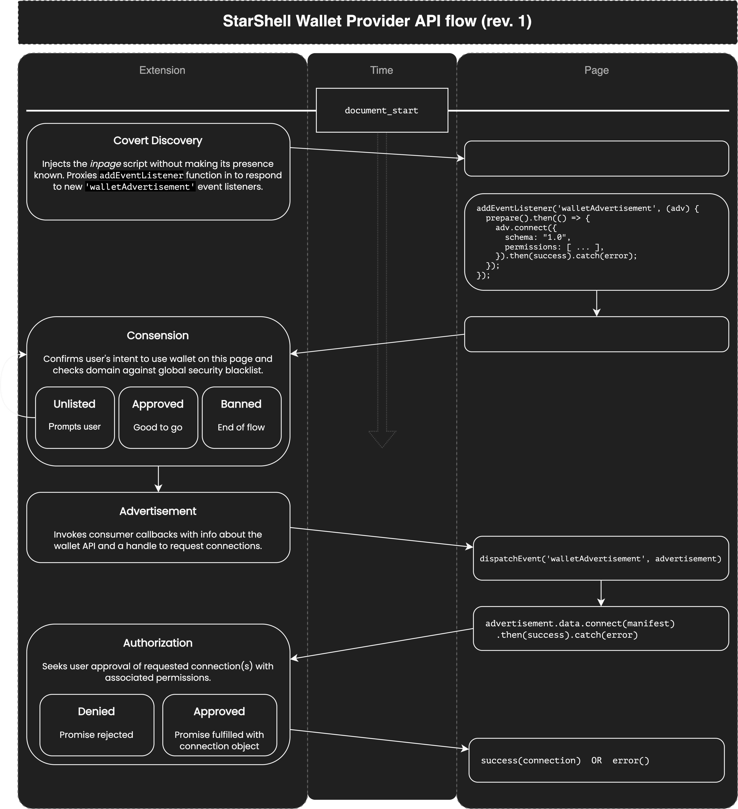

# StarShell Wallet API Primer v0.3

This article is intended for developers who wish to support the StarShell wallet from a webapp or native mobile app.

## Contents
 - [Android](#android)
 - [iOS and iPadOS](#ios-and-ipados)
   - [PWAs on iOS and iPadOS](#a-note-on-pwas-for-ios-and-ipados)
 - [StarShell Link Protocol (S2LP)](#starshell-link-protocol-s2lp)
   - [1. Generate RSA Key Pair](#1-generate-rsa-key-pair)
   - [2. Compose the Connection Request](#2-compose-the-connection-request)
   - [3. Compute an Out-of-Band Authentication Mnemonic](#3-compute-an-out-of-band-authentication-mnemonic)
   - [4. Initiate the Connection](#4-initiate-the-connection)
   - [5. Handling the Connection Response](#5-handling-the-connection-response)
   - [6. Issuing API Requests](#6-issuing-api-requests)
   - [7. Handling API Responses](#7-handling-api-responses)
   - [Process Flow Diagram](#process-flow-diagram)
 - [Web Apps (JavaScript API)](#web-apps-javascript-api)
   - [Covert Discovery](#covert-discovery)
   - [Provider API Flow](#provider-api-flow)

## Android

Communication with StarShell from a native Android app **or PWA** will work using [Android App Links](https://developer.android.com/training/app-links), following a specific process defined here as the [StarShell Link Protocol (S2LP)](#starshell-link-protocol-s2lp).


## iOS and iPadOS

Communication with StarShell from a native iOS/iPadOS app will work using [Apple's Universal Links](https://developer.apple.com/ios/universal-links/), following a specific process defined here as the [StarShell Link Protocol (S2LP)](#starshell-link-protocol-s2lp).


### A Note on PWAs for iOS and iPadOS

At the time of this writing, Progressive Web Apps (PWAs) on iOS do not support Universal Links (nor custom URL schemes), so unfortunately there is no way for the wallet to respond to requests from PWAs directly. There is no guarantee that Apple will adopt [the new `registerProtocolHandler` feature](https://developer.mozilla.org/en-US/docs/Web/API/Navigator/registerProtocolHandler#browser_compatibility). PWAs also run in an isolated frame so installed Safari extensions cannot interact with them. 

The bottom line is that without Universal Link support or protocol handler registration, there is no way for the wallet to bring your PWA to the forgeround, making for a very fragmented UX.

For these reasons, we strongly advise against PWAs in iOS for the moment and suggest simply keeping your dApp as a webapp within Safari where communication with the wallet can take place via the JavaScript API. If you plan on offering a native app either additionally or exclusively, the [communication protocol](#starshell-link-protocol-s2lp) is more complicated.


## StarShell Link Protocol (S2LP)
> for Inter-App Communication on Mobile Platforms

The following section documents the protocol in detail. However, StarShell plans to provide an SDK to handle the implementation of this protocol on the supported mobile platforms.

The premise of bidirectional communication between your native app and the StarShell wallet comes down to a series of exchanges by passing data through Universal Links with callback URLs.

The S2LP protocol was designed to support the following features:
 - Allows apps to connect to multiple accounts simultaneously
 - Allows apps to upgrade the permissions of existing connections
 - Allows users to manage connections between apps and their wallet accounts
 - Ensures messages are delivered to the correct handler
 - Encrypts all user-related data that travel across app boundaries


### 1. Generate RSA Key Pair

In order better protect user privacy, all user-related data exchanged over the S2LP are encrypted using assymetric cryptography. Additionally, this data is placed in the hash fragment of the Universal Link URL to help ensure the information does not leave the device (e.g., in the event that no installed apps are registered to handle the Universal Link causing it to open in the browser).
> The encryption of user-related data across app boundaries helps reduce the risks of leaking sensitive information from potentially malicious third parties that may be present of the device, such as spyware.

Generate a new [RSA-OAEP key pair](https://developer.mozilla.org/en-US/docs/Web/API/SubtleCrypto/encrypt#rsa-oaep_2) (this algorithm was chosen for current and future compatibility with SubtleCrypto for PWAs on platforms that support protocol registration). Save the private key to your app's keychain on the device. Once a connection has been established, this same key can be reused on the same device for future communication.
> It is critical that your app follow this procedure and generate the key on the device itself. StarShell will perform additional checks internally to ensure that such private keys are not being reused across devices.


### 2. Compose the Connection Request

Your app should be prepared to handle two distinct callback URLs for handling all subsequent responses from the wallet (not just the connection request). One callback URL indicates success, while the other indicates error/failure. The origin of these two URLs be identical.

#### Callback URLs
You **MUST** use Universal/App Links for callback URLs. Custom protocol URIs (e.g., `your-app://callback`) are **NOT ALLOWED** to be used as callbacks.

Your callback URLs may specify query parameters (as long as the keys are not prefixed by `s2r-`), and StarShell will append to them. However, the hash fragment is reserved for passing encrypted data and is therefore not allowed in your callback URLs.

Examples of acceptable callback URLs:
 - Success: ```https://your-app-domain/starshell-callback/success```
 - Error: ```https://your-app-domain/starshell-callback/error```

#### Composing the Request URL
Prepare a URL composed of the following elements:
 - Success callback URL
 - Error callback URL
 - StarShell permissions manifest
 - RSA public key

**Request URL template:**
```
https://link.starshell.net/v1/connect
   ?ulc-success={successCallbackUrl}
   &ulc-success={errorCallbackUrl}
   &app-permissions={permissionsManifest}
   &app-pubkey={rsaPubkey}
```


### 3. Compute an Out-of-Band Authentication Mnemonic

In order to reduce the risks from a MITM attack (e.g., from a potential malware capable of rewriting the URL in transit), your app needs to compute a cryptographic hash digest of the URL and present it to the user as a mnemonic for authentication.

The mnemonic is produced by selecting words from the official BIP39 word list in English using the lowest 33 bits from the hash digest.
> For better internationalization, we may consider supporting additional word list languages or even using an emoji-based wordlist. Feedback is welcome during this prerelease phase.

#### Pseudocode for mnemonic production:
```
let digest = sha256(requestURL)

let word1 = wordList[ (digest >> 00) & 0x7FF ]
let word2 = wordList[ (digest >> 11) & 0x7FF ]
let word3 = wordList[ (digest >> 22) & 0x7FF ]

showUser("{word1} {word2} {word3}")
```

Before opening the link to StarShell, display these three words in order and inform the user that they will be asked to verify it in a few seconds within the wallet app.
> To ensure that apps do not bypass this step, StarShell will randomly select one of the words and have the user select the correct option from a multiple choice selection.

#### Example of Prompts to User:
1. Your app: `In a few seconds, you will be asked to verify this phrase: "unfair holiday party" [Connect to StarShell]`
2. StarShell: `Please confirm this phrase: "unfair holiday [tiger | kick | party]"`


### 4. Initiate the Connection

Open the request URL to open the StarShell app on the user's device (if StarShell is not installed, the user will be prompted to install the app from the StarShell website). StarShell will then callback your app by opening the success or error URLs with response data encoded in the query arguments and/or hash fragment of the URL.
> Just remember that callbacks are never guaranteed. It's important that your app does not get stuck in a state where it is expecting a callback from StarShell.

The following list describes the possible outcomes:
1. In the event of an error (such as an invalid public key, domain mismatch, authentication failure, etc.), StarShell will indicate to the user that the app that submitted this request has failed to produce a valid request. Then, they will be asked if they wish to report the error back to the calling app, or cancel the connection altogether.
   `The app requesting permission to your wallet has failed to connect. What would you like to do? [Report the error to {yourAppDomain}]  [Cancel]`
2. In the event that the user rejects the connection, they will be asked if they wish to report back to the app why they are rejecting the connection. This response will also come through the error callback URL.
   `Would you like to inform {yourAppDomain} why you rejected their request? This may help them improve their app by better understanding what their audience wants. You can select and describe which permissions you don't agree with [Submit] [Cancel]`
3. In the event that the user accepts the connection, StarShell **WILL** open the success callback URL with information about the approved connection.


### 5. Handling the Connection Response

#### Error Callback
**NOTE:** StarShell may invoke your error callback URL asynchronously from a StarShell server in order to provide the user some anonymity, for example when they wish to provide comments when rejecting your permission requests.

Again, the error callback will only occur if the user consents to providing your app with feedback. StarShell will append the following arguments to the query:
 - `s2r-reason` : one of `reject | crypto | other` -- provides a short (machine-readable) identifier to indicate the error category. Anything having to do with key exchange, verification, or subsequent en/decryption failures will be categorized as `crypto`, whereas `reject` indicates the user does not agree to the connection request, and `other` is for all other corner-cases.
 - `s2r-description` : _string_ -- a longer description of the error subject to change at any time (i.e., likely not suitable for string matching). Useful for reporting back to your server about potential issues in your app.
 - `s2r-rejections` : _string_ (only present with the `reject` type) -- a comma-separated list of permission identifiers that the user indicated they disagree with. Useful for responding to specific permission rejections (such as giving them ability to opt-out, explaining to the user in further detail why your app requires those permissions, or reporting back to your server for collecting user feedback about permissions they disagree with).
 - `s2r-comments` : _string_ (only present with the `reject` type) -- an optional custom message (limited to 280 characters) from the user provided as feedback to why they disagree with the requested permissions. It is strongly advised you collect this feedback to a central server to better understand why certain users disagree with requested permissions.

#### Success Callback
StarShell guarantees the success callback URL will be opened upon a user approving the connection response. StarShell will append the following arguments to the query:
 - `s2r-pubkey` : _string_ -- the RSA public key you will need to use to encrypt data for all subsequent requests through this connection. This key is also used to identify the conection.
 - `s2r-verify` : _string_ -- the result of encrypting the constant string `"verify"` with the `app-pubkey`; useful as a sanity check to make sure your app is able to decrypt messages coming from StarShell.


For all intents and purposes, the value associated with `s2r-pubkey` is the connection ID to an individual account in the user's wallet. Save this ID in order to reuse this same connection in the future. For example, you might prompt the user to provide a name for this account they connected. Keep in mind, you can always allow the user to connect more accounts by creating new connections, or upgrade the permissions of existing connections.


### 6. Issuing API Requests

At this point, your app has established a connection to an individual account in the wallet and acquired an `s2r-pubkey` to identify that connection and encrypt data to be sent over its channel.

**API request URL template:**
```
https://link.starshell.net/v1/api
   ?s2r-pubkey={connectionId}
   #{encryptedApiRequest}
```

### 7. Handling API Responses

StarShell will use the same success callback URL that was initially defined for this connection with the following query argument:
 - `s2r-pubkey` : _string_ -- identifies which connection the response is coming from

Additionally, the API response data will be placed in the hash fragment:
 - `#{encryptedApiResponse}`

**Pseudocode:**
```
let account = connections[s2rPubkey]
if account:
   apiResponse = parseJson(decode(encryptedApiResponse, appPrivateKey))
```

### Process Flow Diagram

The entire flow is visualized in the following diagram:


## Web Apps (JavaScript API)

The StarShell extension will:
 - **Not** inject any variables into the global window scope by default (i.e., 🚫`window.starshell`).
 - **Require** the use of feature detection rather than API versioning (e.g., `if(walletSupports.someFeature())`).


### Covert Discovery

The current practice of exposing wallet APIs by injecting a variable into the global scope was a poor idea for two primary reasons:
 1. It degrades user privacy. Any website can see these variables, deduce which extensions are installed, and use that to enhance browser fingerprinting or targeted advertising.
 2. It assumes the user only has one wallet extension they'd like to use with some chain, and extensions may end up competing over the same variable, e.g., `window.ethereum`, `window.solana`, or in our case of providing compatibility with Keplr, `window.keplr`.

Given these issues, the StarShell extension will not inject any new variables into the global `window` scope. Instead, sites must explicitly express interest in connecting to a wallet by adding an event listener for `'walletAdvertisement'` to the top `window` object.

You can think of this change as an inversion of control when compared to the traditional approach. This allows the user/wallet to silently ignore sites that only intend to snoop this information from the browser.

_Example:_
```html
<script>
   window.addEventListener('walletAdvertisement', (event) => {
      const advertisement = event.data;

      if(advertisement.features.includes(necessaryFeature)) {
         advertisement.connect({
            schema: '1.0',
            chain: '',
         });
      }
   });
</script>
```


### Provider API Flow

Here is a simplified process flow diagram to illustrate:




### Feature Detection

Wallet APIs are subject to evolve and change over time, adding new features or adapting to the ever-innovating blockchain technologies they operate on.

Rather than requiring developers to build against a single proprietary API, or a version-dependent common API, StarShell will be pursuing a feature detection paradigm with immutable (yet deprecatable) interfaces.

The same way [feature detection works on the Web](https://developer.mozilla.org/en-US/docs/Learn/Tools_and_testing/Cross_browser_testing/Feature_detection#the_concept_of_feature_detection), the idea is that apps simply test if the features it needs are supported by the wallet being advertised. With distinct feature IRIs, it does not matter which wallet is answering the request, nor which version. This paradigm helps ensure maximal forwards and backwards compatibility for both wallets and dApps, the same way feature detection does for browsers and websites.

StarShell will provide a library that exposes both low-level and high-level helpers to support a friendly developer experience when using the API. For feature detection, this includes functions that perform [type-narrowing with predicates](https://www.typescriptlang.org/docs/handbook/2/narrowing.html#using-type-predicates).

Low-level example:
```ts
import {
   walletSupports,
} from 'starshell';

await connection = connectApp();

// type-narrowing feature detection
if(walletSupports.suggestChain(connection)) {
   connection.suggestChain({...});
   //        ^ IDEs will autocomplete
}
```

High-level example:
```ts
import {
   walletSupports,
} from 'starshell';

await connection = connectApp();

// type-casting assignment
let snip20Connection: Snip20Connection = walletSupports.snip20(connection)? connection: null;

// unsupported feature guard
if(!snip20Connection) {
   throw new Error('Wallet does not support all SNIP-20 features so I give up');
}

// aliased connection object is now type fitted
if(snip20Connection.hasViewingKeyFor(token)) {
   // ...
}
```


